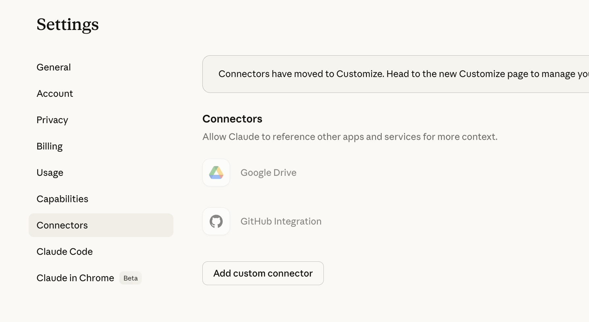
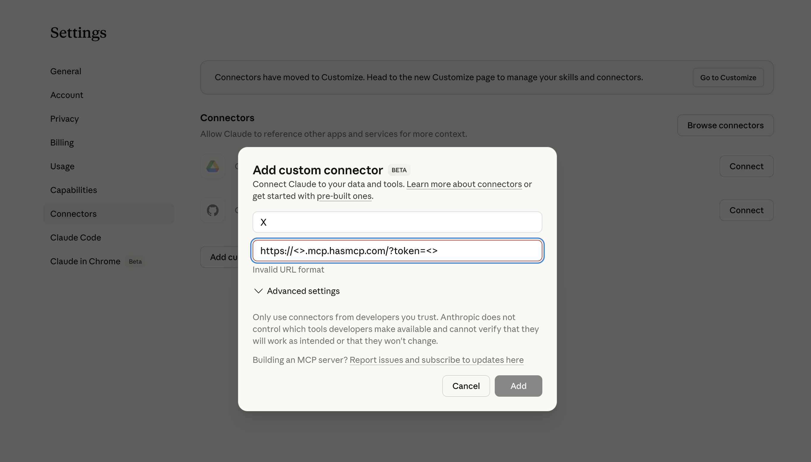

# Connecting to Claude Web

You can connect your HasMCP remote MCP servers to the Claude.AI web application using the built-in **Connectors** feature. Once connected, Claude can call your tools and APIs directly from any conversation in the browser.

## Prerequisites

- A HasMCP account with at least one MCP server configured
- A Claude.AI account (Pro or Team plan required for custom connectors)

## Setup Instructions

<Steps>
  <Step title="Generate a Server Token">
    In your HasMCP dashboard, navigate to your **MCP Server** and click **Generate Token** to create a secure access token. Copy the token — you will need it in the next step.
  </Step>

  <Step title="Open Claude Connectors Settings">
    In the Claude.AI web app, click your profile icon in the top-right corner and select **Settings**. Then click **Connectors** in the left sidebar.

    You will see a list of available connectors along with an **Add custom connector** button.

    
  </Step>

  <Step title="Add Your HasMCP Server as a Custom Connector">
    Click **Add custom connector**. In the dialog that appears, enter your HasMCP server URL with your token appended as a query parameter:

    ```text
    https://<server-subdomain>.mcp.hasmcp.com/?token=<YOUR_ACCESS_TOKEN>
    ```

    Replace `<server-subdomain>` with your server's subdomain and `<YOUR_ACCESS_TOKEN>` with the token you generated in Step 1.

    

    Click **Add** to save the connector.
  </Step>
</Steps>

## Why Use Query String Tokens?

The `?token=<>` query string approach is recommended for Claude.AI connectors because:

- **Compatibility**: It bypasses potential header-stripping issues in the Claude connector interface.
- **Simplicity**: You do not need to configure a separate API key authentication step.
- **Security**: The token is still validated by HasMCP before any tools are executed.

## Troubleshooting

<AccordionGroup>
  <Accordion title="Invalid URL Format error">
    Ensure the URL includes the full subdomain and the `?token=` query parameter. The URL must start with `https://`.
  </Accordion>
  <Accordion title="Token Mismatch">
    Ensure there are no spaces or extra characters in the `?token=` value. Regenerate the token in the HasMCP dashboard if needed.
  </Accordion>
  <Accordion title="Connector not appearing">
    Custom connectors require a Claude Pro or Team subscription. Free accounts may not see the custom connector option.
  </Accordion>
  <Accordion title="Tools not showing in conversation">
    After adding the connector, start a new conversation. Look for the tools icon in the message input area to confirm the server is connected and tools are available.
  </Accordion>
</AccordionGroup>

## Related Reading

- [Generate a Server Token](/kb/generate-server-token)
- [Connect HasMCP MCP Servers to Claude Desktop](/ai-tools/claude-desktop)
