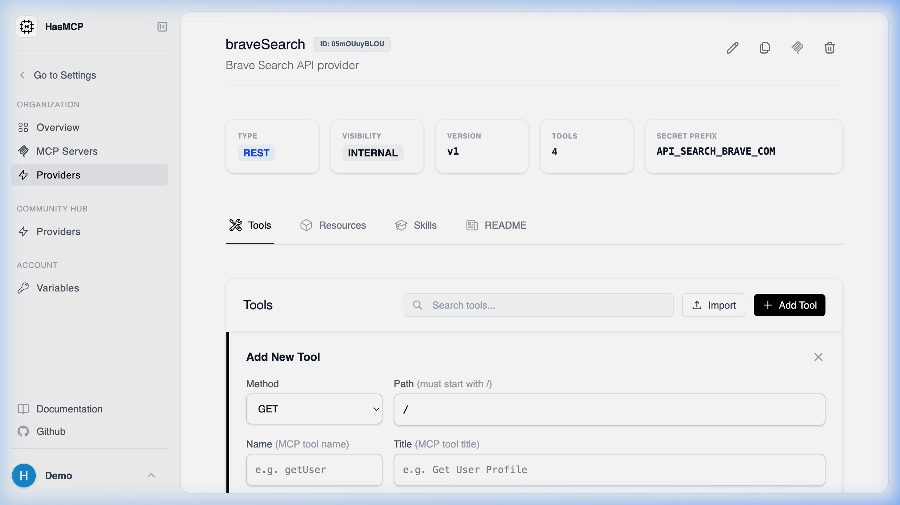

# Adding a New Tool to a Provider

## Using HasMCP UI



The visual dashboard allows you to define complex tools natively:
1. Navigate to the specific **Provider Details** page.
2. In the "Tools" tab or section, click the **Add Tool** button.
3. Define the tool's `name`, `description`, and construct its `inputSchema` (JSON Schema format) that the LLM will use to invoke it.
4. Specify the execution path (e.g., `/v1/users/{user_id}`).
5. Click **Create** to bind the new capability to the provider.

## Using REST API

To declare a new tool programmatically so that your MCP servers can leverage it, you post a `ProviderToolCreate` JSON object to a specific provider's tool collection.

### The Endpoint

**`POST /providers/{providerId}/tools`**

*(Note: Replace `{providerId}` with the 11-character ID of the parent provider).*

### JSON Payload Requirements

Your payload must include a `tool` object containing:
- **`name`** (string): A distinct, programmatic name for the tool (e.g., `get_user_billing`).
- **`description`** (string): Precise instructions to the LLM explaining exactly what this tool does and when to call it.
- **`inputSchema`** (object): A valid JSON schema dictating the arguments the tool expects (what the LLM must generate).
- **`execution`** (object): The routing logic mapping this tool to the actual API endpoint (HTTP method, path, parameter mapping).

### Example cURL Request

```bash
curl -X POST https://app.hasmcp.com/api/v1/providers/kSuB9Gf6aD4/tools \
  -H "Authorization: Bearer YOUR_TOKEN" \
  -H "Content-Type: application/json" \
  -d '{
    "tool": {
      "name": "lookup_customer",
      "description": "Searches the CRM for a customer by email address.",
      "inputSchema": {
        "type": "object",
        "properties": {
          "email": { "type": "string" }
        },
        "required": ["email"]
      },
      "execution": {
        "method": "GET",
        "path": "/api/v2/customers/search"
      }
    }
  }'
```
