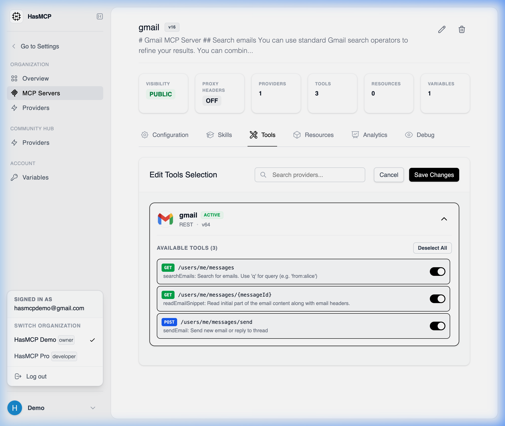

# Associating a Tool with an MCP Server

## Using HasMCP UI



To authorize a specific MCP server to use a tool from your Provider catalog:
1. Navigate to the **MCP Servers** page and select the server you wish to configure.
2. Open the **Tools** tab.
3. Click the **Add Tool** button.
4. A selection modal appears. Choose the **Provider** that owns the tool, and then select the specific **Tool** you want to associate.
5. Confirm the addition. The server immediately gains runtime access to the tool.

## Using REST API

Programmatically linking tools to servers establishes the execution boundary for your AI agents. 

### The API Endpoint

To create a new association mapping between a server and a tool, submit a `POST` request to the server's nested tools path.

**`POST /servers/{serverId}/tools`**

### JSON Payload Requirements

You must provide a `tool` object that maps all three fundamental relationships (the Server receiving the tool, the Provider hosting the tool, and the distinct Tool itself).

```json
{
 "tool": {
 "serverID": "sE8vKd2qLp9",
 "providerID": "kSuB9Gf6aD4",
 "toolID": "tH4mZw9xV2n"
 }
}
```

### Example Request

```bash
curl -X POST https://app.hasmcp.com/api/v1/servers/sE8vKd2qLp9/tools \
 -H "Authorization: Bearer YOUR_TOKEN" \
 -H "Content-Type: application/json" \
 -d '{
 "tool": {
 "serverID": "sE8vKd2qLp9",
 "providerID": "kSuB9Gf6aD4",
 "toolID": "tH4mZw9xV2n"
 }
 }'
```

If successful, the API returns a `CreateServerToolResponse` with a `201 Created` status, confirming the mapped execution permissions.
