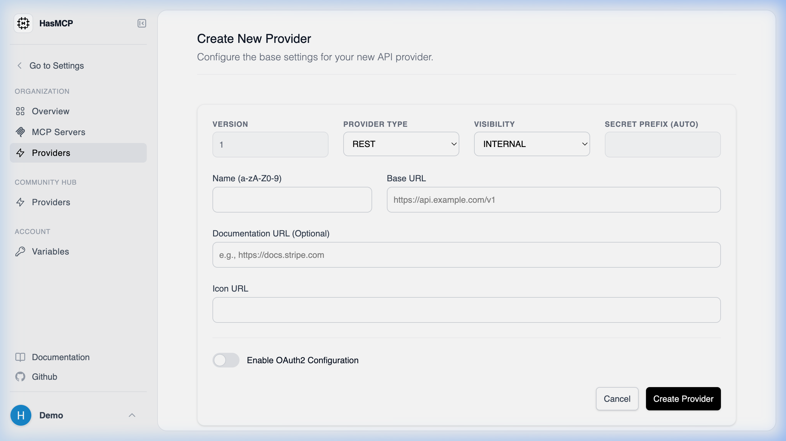

# Creating a New Provider

## Using HasMCP UI



To create a new Provider visually:
1. Navigate to **Providers** from the left-hand menu.
2. Click the **Add Provider** button.
3. Fill out the form fields, entering the API's name, its Base URL, and specifying the visibility type.
4. Save the configuration to register the API provider in your catalog.

## Using REST API

In HasMCP, a **Provider** represents an external API or service that you want to connect to. Generating a provider programmatically is the first step in making background API tools available to your MCP servers.

### Provider Creation Route

You create a provider by sending an authenticated `POST` request to the `/providers` endpoint.

**`POST /providers`**

### Building the Request Payload

To register a provider, construct a JSON payload based on the `CreateProviderRequest` schema. This requires a nested `provider` object containing details about the remote API.

#### Mandatory and Common Fields

- `name` (string): A short, recognizable API identifier.
- `baseURL` (string, uri): The root URL of the API you are consuming.
- `apiType` (string): The architecture of the API (currently `"REST"`).
- `visibilityType` (string): Set to `"INTERNAL"` or `"PUBLIC"`.
- `description` (string): A helpful summary of what the provider does.

#### Example cURL Request

```bash
curl -X POST https://app.hasmcp.com/api/v1/providers \
 -H "Authorization: Bearer YOUR_TOKEN" \
 -H "Content-Type: application/json" \
 -d '{
 "provider": {
 "name": "stripeApi",
 "baseURL": "https://api.stripe.com/v1",
 "apiType": "REST",
 "visibilityType": "PUBLIC",
 "description": "Payment processing provider.",
 "documentURL": "https://stripe.com/docs/api"
 }
 }'
```

A successful request returns a `201 Created` status with the newly generated `Provider` object, which includes a unique 11-character `id`. You will use this ID to attach tools and bind the provider to your MCP servers.
