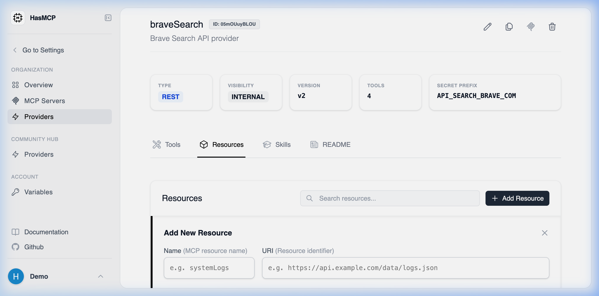

# Creating a Provider Resource

## Using HasMCP UI



To define a new data resource in the dashboard:
1. Navigate to the specific **Provider Details** page.
2. Select the **Resources** tab.
3. Click the **Add Resource** button.
4. Input the `name` (a unique URI-like string identifying the resource, e.g., `https://api.example.com/logs/system.log`), the `mimeType` (e.g., `text/plain` or `application/json`), and providing an optional `description`.
5. Map the `execution` path the server will call to retrieve this data.
6. Click **Create** to bind the resource to the provider catalog.

## Using REST API

A Resource in MCP is typically used for injecting static files, database schemas, or distinct read-only data blobs into an agent's context.

### The API Endpoint

To programmatically declare a resource, you `POST` a `ProviderResourceCreate` object to the provider's nested resources path.

**`POST /providers/{providerId}/resources`**

### JSON Payload Requirements

Your payload requires a `resource` object containing:
- **`name`** (string): A short contextual name for the resource (e.g., `Error Logs`).
- **`uri`** (string): The standard `https://` REST URL where the resource data can be fetched (e.g., `https://api.example.com/v1/system/logs/error`).
- **`mimeType`** (string): The standard MIME format of the data returned by this endpoint.
- **`description`** (string, optional): A brief explanation of the data blob.

### Example JSON Payload

```json
{
  "resource": {
    "name": "Error Logs",
    "uri": "https://api.example.com/v1/system/logs/error",
    "description": "The tail end of the application's daily error logs.",
    "mimeType": "text/plain"
  }
}
```
