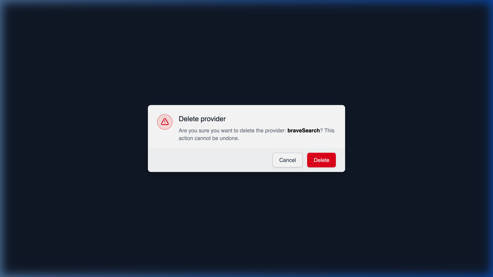

# Deleting an API Provider

## Using HasMCP UI



To delete a provider through the management dashboard:
1. Navigate to the detail view of the **Provider**.
2. Locate and click on the **Delete** button.
3. A confirmation modal will appear advising you that all associated tools and connections will be lost. Click **Confirm** to permanently delete the mapping.

## Using REST API

If an external integration is aggressively deprecated and completely removed from your workflow, you can cleanly strike the provider's existence from your workspace using the deletion endpoint.

### The Endpoint Route

**`DELETE /providers/{id}`**

### Deleting via API Request

Using the 11-character `id` of the provider in question, make an authenticated call:

```bash
curl -X DELETE https://app.hasmcp.com/api/v1/providers/kSuB9Gf6aD4 \
  -H "Authorization: Bearer YOUR_TOKEN"
```

A return code of `204 No Content` confirms successful execution. 

> **Important Consequence:** Initiating this DELETE action on a provider recursively breaks and removes any `ProviderResource`, `ProviderPrompt`, and `ProviderTool` instances intimately linked to it, effectively cutting those lifelines to any connected MCP Servers traversing them.
