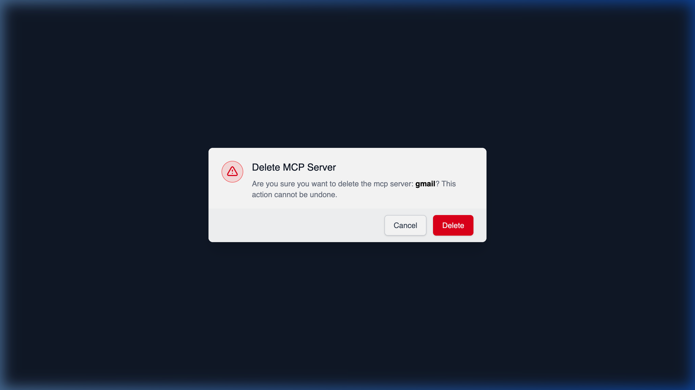

# Consequences of a DELETE Request

## Using HasMCP UI

When you attempt to delete a server in the dashboard, the UI warns you about the destructive nature of the action. Clicking **Confirm** triggers the `DELETE` request in the background.

## Using REST API

Sending a `DELETE /servers/{id}` request programmatically is a destructive action that permanently de-provisions your MCP server from the HasMCP Manager.

### Cascade Effects

When the `204 No Content` status is returned:

1. **Server Configuration Removed**: All metadata associated purely with the server (`name`, `instructions`, `version`) is destroyed.
2. **Tokens Revoked**: Any active tokens specifically generated for this MCP server (`ServerToken`) are immediately invalidated and deleted. This protects against unauthorized future access.
3. **Associations Dropped**: Connections mapping this server to `providers`, `tools`, `resources`, and `prompts` are severed.
4. **Underlying Entities Remained Untouched**: Importantly, deleting a server *does not* delete the underlying Provider, Tool, or Prompt configurations from the manager. These exist globally in your workspace and remain fully available to be attached to other active servers.
