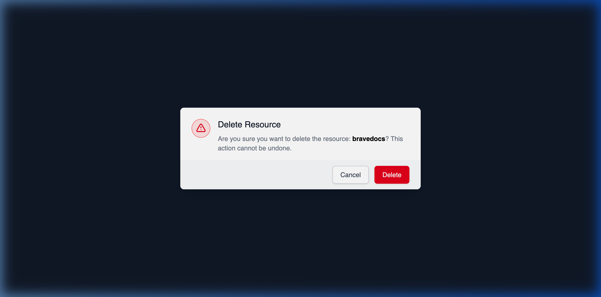

# Deleting a Resource from a Provider

## Using HasMCP UI



Should you need to permanently remove a configured data resource mapping using the dashboard interface:
1. Go to the **Resources** tab on the Provider Details page.
2. Find the mapped resource.
3. Click the **Delete** button.
4. Verify your decision in the resulting confirmation dialog ensuring you understand the downstream impacts to bound servers.

## Using REST API

To entirely purge a contextual resource mapping from a provider programmatically, you invoke the nested deletion endpoint.

### The API Endpoint

**`DELETE /providers/{providerId}/resources/{id}`**

### Dispatching the Command

By targeting the explicitly unique resource ID inside the specific provider boundary path, you execute a silent hard-delete.

```bash
curl -X DELETE https://app.hasmcp.com/api/v1/providers/kSuB9Gf6aD4/resources/rA9BdO1kZ5T \
 -H "Authorization: Bearer YOUR_TOKEN"
```

A response of `204 No Content` confirms the irreversible deletion of the mapping.

> **Critical Warning:** Deleting a root `ProviderResource` permanently cascades and deletes all `ServerResource` association bridges mapped to it across your infrastructure. If a "Sales DB Schema" resource is deleted here, the three active LLM agents previously linked to it will immediately lose access to that dataset context.
