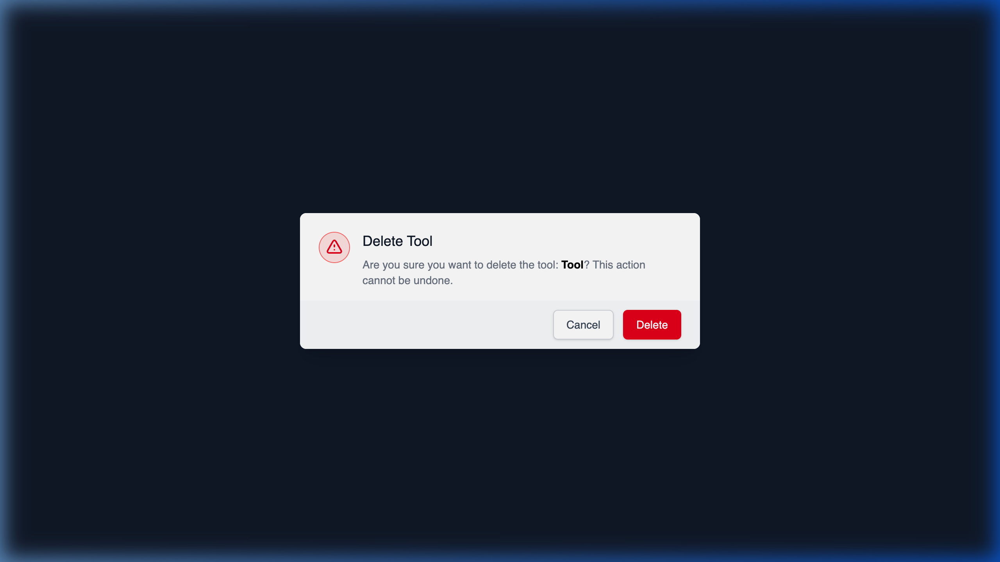

# Deleting a Tool from a Provider

## Using HasMCP UI



Removing a tool using the dashboard interface:
1. Navigate to the Provider containing the tool.
2. In the Tools list, locate the specific capability you intend to revoke.
3. Click the **Delete** button next to it.
4. Verify the destructive action in the warning modal and confirm. 

## Using REST API

When a capability is permanently deprecated from an external API or you wish to cleanly prune your integration catalog, you use the nested tools deletion endpoint.

### The API Endpoint

**`DELETE /providers/{providerId}/tools/{id}`**

### Executing the Deletion

Using the specific hashes identifying the provider and the tool, simply dispatch a DELETE request.

```bash
curl -X DELETE https://app.hasmcp.com/api/v1/providers/kSuB9Gf6aD4/tools/tOlM8Hr2zP1 \
 -H "Authorization: Bearer YOUR_TOKEN"
```

A response of `204 No Content` confirms the tool has been deleted.

> **Warning:** Deleting a tool acts as a cascading delete for any `ServerTool` associations that rely on it. If this tool was attached to 10 different MCP Servers, removing the master `ProviderTool` here will break and drop those local mapped connections on all 10 servers simultaneously.
