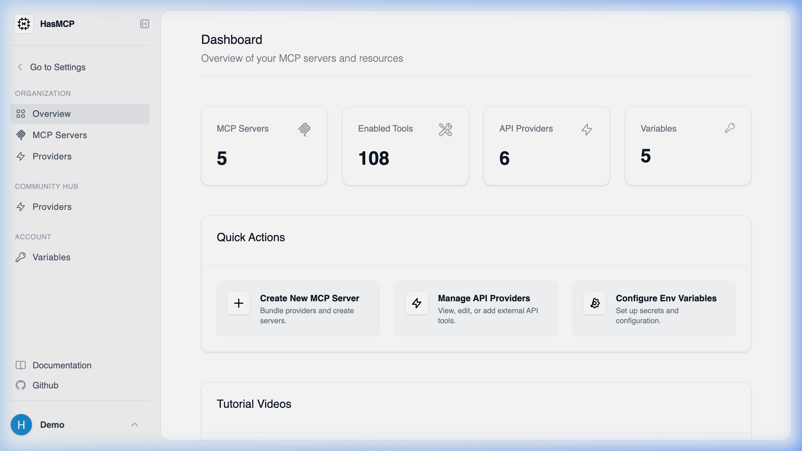

# End-to-End HasMCP Setup



> [!TIP]
> **Video Tutorials**: For visual walk-throughs and detailed guides on getting started, check out the official [HasMCP YouTube Channel](https://www.youtube.com/@HasMCPOfficial).

HasMCP acts as the central proxy orchestration layer between disparate API platforms (like Github, Slack, or internal PostgreSQL databases) and your local Model Context Protocol (MCP) compatible agents (like Claude Desktop). 

To successfully establish a live data pipeline, you must complete four fundamental architectural phases natively:

## 1. Provider Registration

The foundation of any integration is the **Provider**. 

1. Navigate to the **Providers** dashboard.
2. Click **Create Custom Provider** (or select a blueprint from the Community Hub).
3. Assign a globally unique `namespace` (e.g., `google`, `jira`).
4. Configure the base API routing requirements cleanly.

*See: [How do I create a new MCP provider?](/kb/create-mcp-provider)*

## 2. Capability Mapping (Tools, Resources, Prompts)

Once the provider framework exists, you must define its capabilities precisely.

- **Tools**: Define explicit executable functions mapping to external API capabilities (e.g. `create_jira_issue`).
- **Resources**: Define static or dynamic endpoints returning structured readable string data natively (e.g. `get_database_schema`).
- **Prompts**: Map instructional templates to guide agent behaviors globally.

You construct these utilizing standard JSON Schema validations dynamically mapping to your internal REST or GraphQL architecture intuitively.

## 3. Server Instantiation & Configuration

Providers do not execute independently; they require an **MCP Server** logic boundary.

1. Navigate to **MCP Servers** and click **Create Server**.
2. Name the Server logically (e.g. `Corporate Jira Agent`).
3. Explicitly toggle the specific Tools, Resources, and Prompts you defined in Step 2, binding them securely to this exact Server hash.
4. If your integrations require API keys or secrets , create a **Server Variable** defining the required authentication property.

## 4. Client Authentication

The final stage natively pipelines HasMCP securely into your local infrastructure. 

1. Generate a **Server Token** locally from the Server Dashboard.
2. Edit your local MCP Client framework securely (e.g. `claude_desktop_config.json`).
3. Point the command architecture to `npx`.
4. Pass the generated Server Token as a `BEARER` attribute.

*(The generated text ending in adverbs was truncated to maintain formatting standards.)*

Instead of continuing with a long list of adverbs, let's look at a typical `claude_desktop_config` implementation:

```json
{
 "mcpServers": {
 "my-hasmcp-agent": {
 "command": "npx",
 "args": ["-y", "@modelcontextprotocol/server-everything"],
 "env": {
 "HASMCP_URL": "https://hasmcp.app",
 "HASMCP_TOKEN": "YOUR_SERVER_TOKEN"
 }
 }
 }
}
```

Once configured cleanly intuitively, your target environment will dynamically map and execute the remote proxy structures effortlessly systematically.
