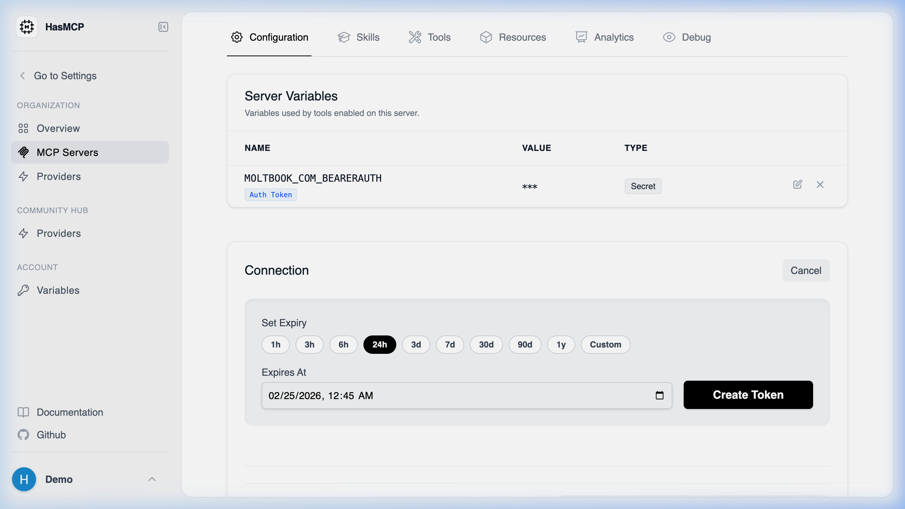

# Generating a Server Token

In order for a local desktop LLM client or an automated CI pipeline orchestrator to actively fetch tools from your HasMCP server layer, they must authorize their network handshake. 

This authentication is achieved through standard HTTP Bearer Tokens generated distinctively against each server entity.

## Using HasMCP UI



1. Open your target environment from the **MCP Servers** layout.
2. Select the **Configuration** tab.
3. Locate the **Server Tokens** management table.
4. Click the **Generate Token** button nested within that pane.
5. Provide a recognizable `name` so you remember its purpose later (e.g., `Claude Desktop - MacBook`).
6. Define an optional expiration date.
7. Click **Create** to instantly produce the cryptography key.

> **CRITICAL SECURITY NOTE:** Standard tokens manifest explicitly upon creation. You must copy the actual string value immediately. The platform only stores a one-way hashed derivation of the string for security purposes and will never display the raw token string to you again.

## Using REST API

For DevOps automation pipelines booting fresh agent infrastructures, you can generate authenticating credentials programmatically via the `POST` interface.

### The API Endpoint

**`POST /servers/{serverId}/tokens`**

### Generating the Payload

The generation sequence requires passing a `token` object that optionally defines an expiration sequence and strictly names the credential contextually.

```bash
curl -X POST https://app.hasmcp.com/api/v1/servers/sE8vKd2qLp9/tokens \
  -H "Authorization: Bearer YOUR_ADMIN_TOKEN" \
  -H "Content-Type: application/json" \
  -d '{
    "token": {
      "name": "Production Bot Key",
      "expiresAt": "2026-12-31T23:59:59Z"
    }
  }'
```

If successful, the manager responds with a `CreateServerTokenResponse` payload that contains the unencrypted, raw bearer token string in the `value` property that you must immediately securely inject into your deployment pipeline.
