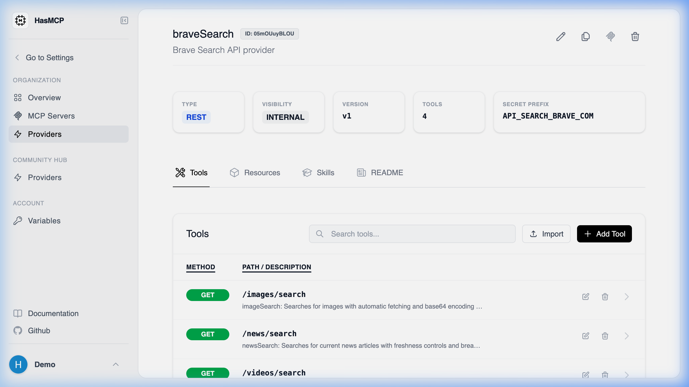

# Getting Specific Provider Details

## Using HasMCP UI



To view all the information about a specific provider in the dashboard:
1. Navigate to the **Providers** menu.
2. Click on the name or the card of the Provider you want to inspect.
3. You will be taken to a dedicated page outlining its endpoints, active tool mappings, and OAuth2 configurations.

## Using REST API

To fetch the full configuration of a specific API provider programmatically, you must make a `GET` request using the provider's unique 11-character identifier.

### The Endpoint

**`GET /providers/{id}`**

### Example Request

```bash
curl -X GET https://app.hasmcp.com/api/v1/providers/kSuB9Gf6aD4 \
  -H "Authorization: Bearer YOUR_TOKEN"
```

### The Response payload

The endpoint returns a `200 OK` status and provides a `GetProviderResponse` object. The response features a fully populated `Provider` schema containing:
- The base routing URL and Name.
- Bound resource mappings and prompts.
- All mapped `tools` natively associated with the provider, which can subsequently be attached to servers.
