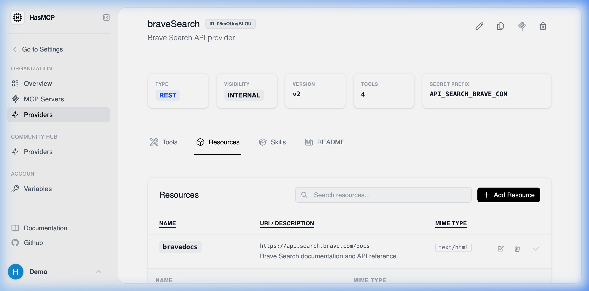

# Retrieving Details of a Specific Provider Resource

## Using HasMCP UI



To view the properties of a singular resource directly:
1. Open the specific **Provider Details** page.
2. Select the **Resources** tab to view the list.
3. Click on the resource row or the "View" button to expand and inspect its native configuration formatting.

## Using REST API

To retrieve the deep metadata payload for a single, specific resource assigned to an API provider programmatically, query its direct nested path format.

### The API Endpoint

**`GET /providers/{providerId}/resources/{id}`**

You must map both context identifiers securely:
- `{providerId}`: The ID of the owning API catalog provider.
- `{id}`: The unique 11-character ID assigned specifically to the exact Resource mapping.

### Example Request

```bash
curl -X GET https://app.hasmcp.com/api/v1/providers/kSuB9Gf6aD4/resources/rA9BdO1kZ5T \
  -H "Authorization: Bearer YOUR_TOKEN"
```

A properly authenticated request returns a `200 OK` status with a `GetProviderResourceResponse` payload, encapsulating the `resource` dictionary containing its exact `mimeType` formatting rules, and `uri` identifier instructions.
