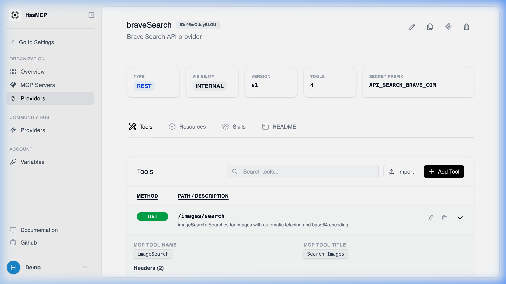

# Viewing Details of a Specific Provider Tool

## Using HasMCP UI



In the dashboard, locating specific tool details entails:
1. Opening the **Provider Details** page.
2. Under the Tools section, finding the tool in the list.
3. Clicking on the tool row or a "View" action to open its dedicated property pane showing its execution path and input schema.

## Using REST API

If you need the exhaustive JSON profile of an individual tool natively assigned to a provider, you will execute a `GET` request addressed directly to the tool's ID nested under the provider.

### The API Endpoint

**`GET /providers/{providerId}/tools/{id}`**

You must provide both identifiers:
- `{providerId}`: The 11-character hash of the parent Provider.
- `{id}`: The 11-character hash of the individual Tool.

### Example Request

```bash
curl -X GET https://app.hasmcp.com/api/v1/providers/kSuB9Gf6aD4/tools/tOlM8Hr2zP1 \
 -H "Authorization: Bearer YOUR_TOKEN"
```

A successful request returns a `200 OK` response with a `GetProviderToolResponse` object. This schema exposes all defined prompt instructions, the specific execution URI segment, and HTTP method matching rules for this exact tool.
