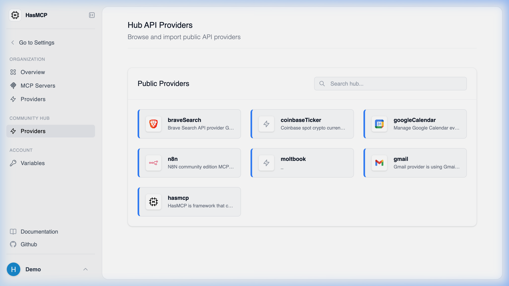
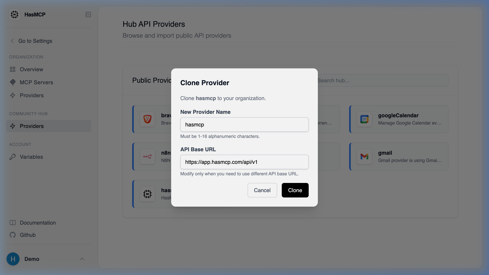
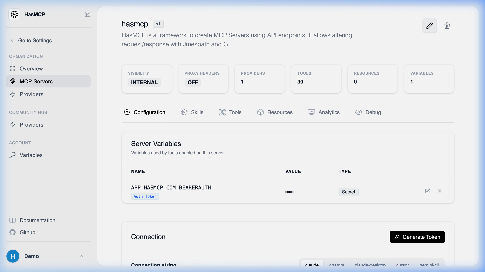

# Installing the Official HasMCP Server

HasMCP exposes its own capabilities as a fully compliant Model Context Protocol (MCP) server. By connecting your local LLM client (like Claude Desktop or Cursor) to the official HasMCP server, you give your AI agent the ability to self-provision, inspect, and manage its own architecture iteratively.

Your AI can dynamically create new Providers, attach new Tools from external APIs, and bundle them into new remote MCP Servers on the fly.

## Installation Steps through the UI

HasMCP makes its official server available in the Community Hub. To deploy it securely under your own account:

1. Navigate to the **Community Hub** at `https://app.hasmcp.com/h/providers`.
2. Locate and click on the **`hasmcp`** provider row.

3. In the provider details modal window, click the **Clone** button to copy the provider definition directly into your private workspace securely.

4. Once cloned, navigate to your new private version of the `hasmcp` Provider.
5. In the top-right corner of the Provider screen, click the **Generate MCP Server** icon (the official MCP logo).

> [!TIP]
> **Automatic Authentication**: When generating the official HasMCP server this way, the platform automatically attaches and binds your necessary access token variables to the new server for ease of use. It is instantly ready for your LLM client.

6. You will be redirected to the new MCP Server dashboard. Notice under the **Server Variables** section that your specific organizational Bearer Token is already dynamically attached to this server instance.

