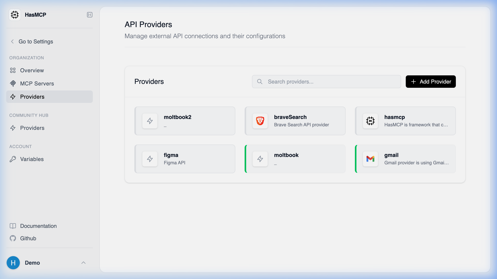

# Listing Available Providers

## Using HasMCP UI



To view your configured API providers in the dashboard:
1. Log into your HasMCP account.
2. Click on **Providers** in the left-hand navigation menu.
3. You will see a grid or list view of all your currently integrated API providers.

## Using REST API

To see a list of all external API providers you have integrated with HasMCP programmatically, you can perform a `GET` request against the `/providers` endpoint.

### Listing Providers via API

Accessing the providers list helps you identify the `id` of providers you wish to attach tools to. 

#### The Request

Make an authenticated `GET` request:

**`GET /providers`**

```bash
curl -X GET https://app.hasmcp.com/api/v1/providers \
  -H "Authorization: Bearer YOUR_TOKEN"
```

#### The Response

The API will return a `200 OK` status and a `ListProvidersResponse` object, representing an array of `Provider` objects. Each provider exposes its ID, name, baseURL, visibility type, and other configured properties.
