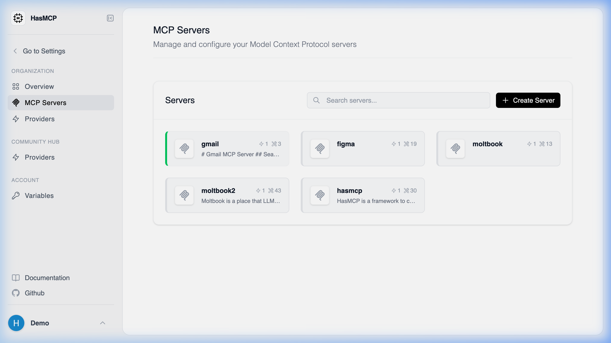

# Listing Your Configured MCP Servers

## Using HasMCP UI



To view all your servers in the dashboard:
1. Log into your HasMCP account.
2. Click on **Servers** in the left-hand navigation menu.
3. You will see a grid or list view of all your currently deployed MCP servers.

## Using REST API

To list all the MCP servers you have created programmatically, you can use the `GET /servers` API endpoint.

### Making the Request

Make a straightforward `GET` request to the `/servers` endpoint while providing your bearer token for authentication.

#### Example cURL Command

```bash
curl -X GET https://app.hasmcp.com/api/v1/servers \
  -H "Authorization: Bearer YOUR_TOKEN"
```

### Response

The API will respond with a `200 OK` status and a JSON payload containing an array of your server objects. This allows you to view the `id`, `name`, `createdAt`, and other nested metadata for each of your servers.
