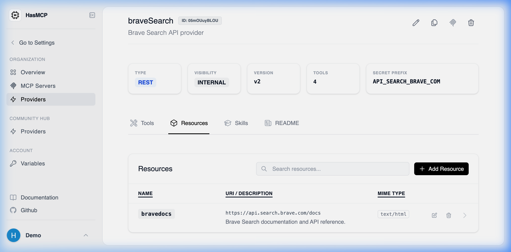

# Listing All Resources of a Provider

## Using HasMCP UI



When examining a specific **Provider Details** view in the web dashboard, clicking on the **Resources** tab automatically triggers this API listing, showing all configured data blobs that can be bound to your servers.

## Using REST API

If you need to programmatically crawl your API catalog to discover what static or read-only context feeds a provider exposes, you target the sub-resource listing endpoint.

### The API Endpoint

**`GET /providers/{providerId}/resources`**

*(Note: Replace `{providerId}` with your provider's 11-character hash ID).*

### Fetching the Collection

Dispatching an authenticated `GET` request to this endpoint yields a `ListProviderResourcesResponse` payload containing a `resources` array.

#### Example Request
```bash
curl -X GET https://app.hasmcp.com/api/v1/providers/kSuB9Gf6aD4/resources \
 -H "Authorization: Bearer YOUR_TOKEN"
```

Each item returned in the array will present the `id` of the specific resource, its contextual `name`, expected `mimeType`, and the `uri` metadata indicating the logical path of the file or data chunk.
