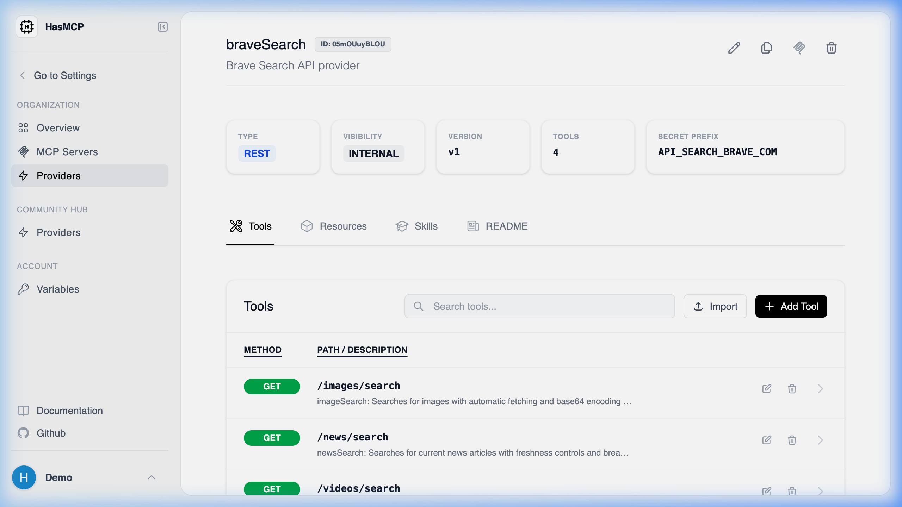

# Listing All Tools for a Provider

## Using HasMCP UI



When you look at a **Provider Details** page in the dashboard, the "Tools" section automatically executes this query, rendering all associated tools in a clear, paginated data table.

## Using REST API

When you need to programmatically explore what capabilities a specific provider possesses, you can fetch its entire tool inventory via a sub-routed `GET` request.

### The API Endpoint

**`GET /providers/{providerId}/tools`**

### Retrieving the Tool List

By supplying the target `{providerId}`, the HasMCP Manager API will return a `ListProviderToolsResponse` object containing a `tools` array.

#### Example Request

```bash
curl -X GET https://app.hasmcp.com/api/v1/providers/kSuB9Gf6aD4/tools \
 -H "Authorization: Bearer YOUR_TOKEN"
```

#### What's Included

Every item in the returned `tools` array provides:
- The `id` of the tool itself.
- Information on the `inputSchema` that must be fulfilled by an LLM to trigger it.
- The `execution` path defining how HasMCP routes the elicitation to the underlying third-party API.
