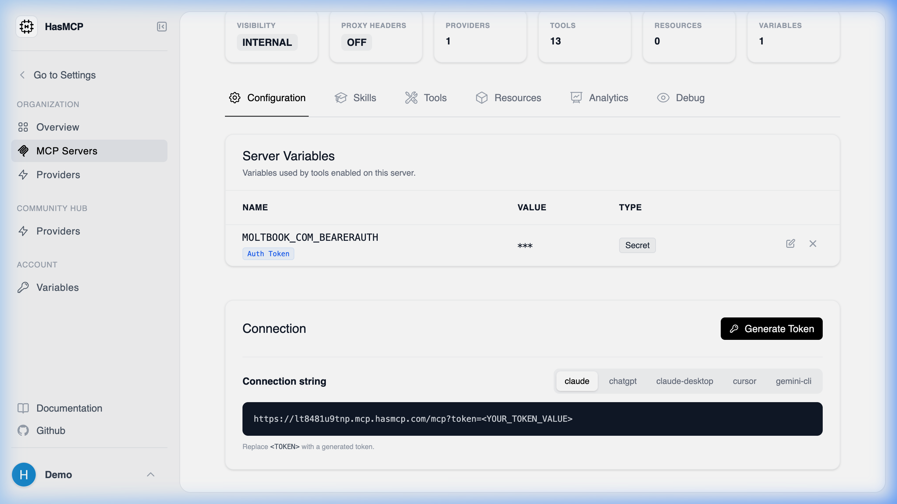

# Listing Active Server Tokens

Administrators continuously monitoring active infrastructure deployments should verify explicit connection points dynamically mapping back to known hardware or client applications systematically. 

## Using HasMCP UI



1. Navigate internally to the designated Server instance originating via your **MCP Servers** routing view.
2. Select the **Configuration** tab.
3. Review the **Server Tokens** array table for immediate visual confirmation of all generated token structures (their metadata, issuance dates, names, and explicit termination timestamps natively).

## Using REST API

To compile unified vulnerability checks dynamically utilizing pipeline audit mechanisms against explicit token expirations organically.

### The API Endpoint

**`GET /servers/{serverId}/tokens`**

Executing this simple `GET` action causes the orchestrator to dump a relational catalog array mapping to the specific orchestrator object.

### Response Data Format

A successful transaction produces the native `ListServerTokensResponse` housing a standard `tokens` array dictionary.

```json
{
  "tokens": [
    {
       "id": "tQ9pV1mN8xK",
       "serverID": "sE8vKd2qLp9",
       "name": "Claude Desktop Beta",
       "expiresAt": "2027-01-01T00:00:00Z",
       "createdAt": "2026-01-15T12:00:00Z"
    }
  ]
}
```

> **Note:** As a direct security precaution inherent to the HasMCP database, the raw authentication `value` arrays are permanently inaccessible after their initial native creation step and will **not** populate within this array schema.
