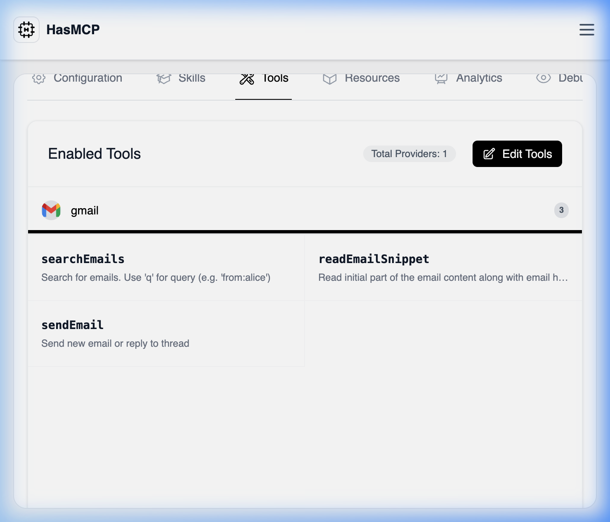

# Listing All Tools Associated with an MCP Server

## Using HasMCP UI



Viewing active tool permissions through the UI:
1. Open up an active server from the **MCP Servers** dashboard.
2. Select the **Tools** tab.
3. This page automatically renders the `listServerTools` network request, displaying all connected tools, detailing their origin Provider, operational status, and description configuration. 

## Using REST API

For automation, auditing, and observability scripts, fetching a server's active tools guarantees visibility into what an LLM agent is physically permitted to execute.

### The API Endpoint

**`GET /servers/{serverId}/tools`**

By submitting a `GET` command, the HasMCP manager proxies a query resolving all active associations.

### Example Request

```bash
curl -X GET https://app.hasmcp.com/api/v1/servers/sE8vKd2qLp9/tools \
 -H "Authorization: Bearer YOUR_TOKEN"
```

A successful transaction delivers a [`ListServerToolsResponse`](/api-reference/servers/tools/list-mcp-server-tools) containing a `tools` array. Each object maps back to the precise `serverID`, `providerID`, and `toolID` relationship, guaranteeing cross-system auditability.
