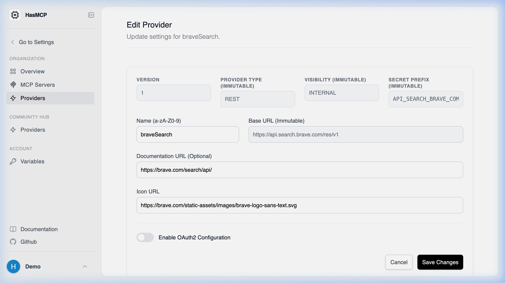

# The Provider Update Endpoint

## Using HasMCP UI



Updating a provider is simple through the UI:
1. Go to the **Providers** list and click on the provider you want to configure.
2. Click the **Edit** button.
3. Update the required fields (e.g., baseURL, description) and hit **Save**.

## Using REST API

The explicit API endpoint for updating the configuration of an existing provider in the HasMCP architecture is:

**`PATCH /providers/{id}`**

### Implementing Provider Updates

This action is crucial when an underlying external API changes its versioned `baseURL` or if you need to seamlessly rotate `oauth2Config` credentials (like client secrets).

#### Constructing the Request

1. Address the request to the specific provider ID routing path securely.
2. Embed an `UpdateProviderRequest` JSON object mapping new properties inside the `provider` dictionary.

#### Example Request

```bash
curl -X PATCH https://app.hasmcp.com/api/v1/providers/kSuB9Gf6aD4 \
 -H "Authorization: Bearer YOUR_TOKEN" \
 -H "Content-Type: application/json" \
 -d '{
 "provider": {
 "baseURL": "https://api.updated.example.com/v3",
 "visibilityType": "PUBLIC"
 }
 }'
```

If the modification is processed correctly, the HasMCP Manager responds with `200 OK` and the returned `UpdateProviderResponse` details the changes.
