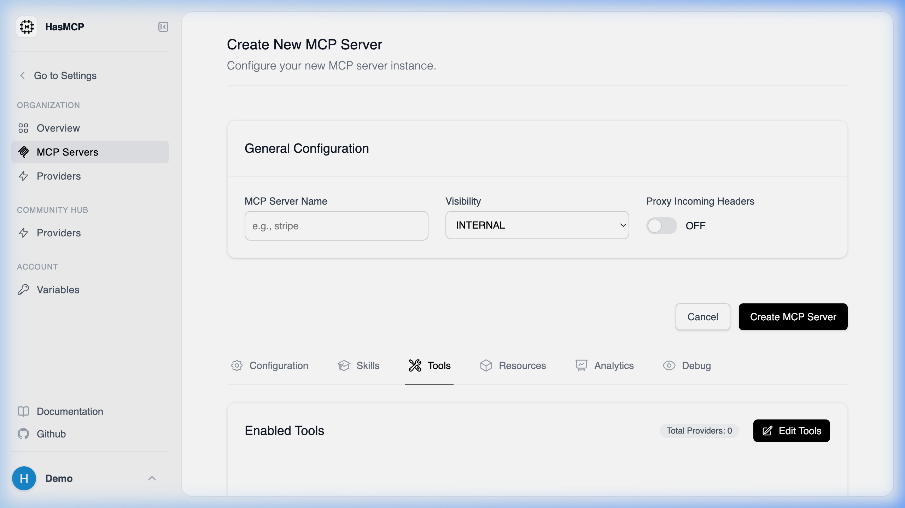

# JSON Payload for Creating an MCP Server

## Using HasMCP UI



When using the dashboard to create an MCP Server, the UI form automatically constructs the required JSON payload for you based on the fields you fill out (Name, Instructions, Providers, etc.).

## Using REST API

When creating an MCP server programmatically via the `POST /servers` endpoint, your request body must contain a JSON object conforming to the `CreateServerRequest` schema.

### Required Structure

The payload must have a root `server` object containing your configuration details. The server `name` is typically the most crucial starting property.

#### Schema Map

- `server` (object, required):
  - `name` (string): The name of your MCP server.
  - `instructions` (string): System prompts or initial instructions for the server.
  - `version` (integer): The numeric version of the server configuration.
  - `providers` (array of objects): Associated API providers. Each object requires an `id` and optionally an array of `tools` (each with an `id`).
  - `resources` (array of objects): Associated resources (requires an `id`).
  - `prompts` (array of objects): Associated prompts (requires an `id`).

#### Example JSON Payload

```json
{
  "server": {
    "name": "Customer Support Server",
    "instructions": "Help customers answer order-related questions.",
    "version": 1,
    "providers": [
      {
        "id": "kSuB9Gf6aD4",
        "tools": [
          {
             "id": "tOlM8Hr2zP1"
          }
        ]
      }
    ]
  }
}
```
