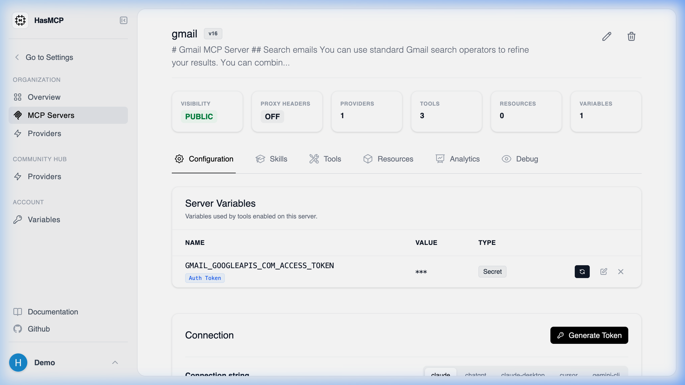

# API Route for Server Details

## Using HasMCP UI

When viewing a server's details in the UI, the browser internally fetches data from the API to populate the dashboard. You can access the same data programmatically.

## Using REST API

The specific API route to fetch the full details of an individual MCP server is:

**`GET /servers/{id}`**

### Route Details

- **Method**: `GET`
- **Path Parameter**: `id` (string, required) - The exact 11-character identifier of the server you wish to inspect.
- **Response**: Returns a `200 OK` status with a JSON body conforming to the [`GetServerResponse`](/api-reference/servers/get-mcp-server) schema.

This route exposes the complete structure of the specific server, which is essential when auditing a server's provider setup, inspecting its prompt attachments, or verifying its updated configuration version.
