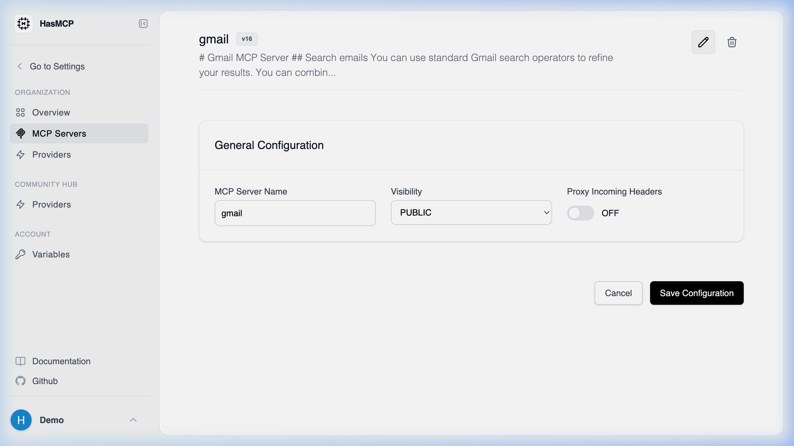

# The Update Endpoint

## Using HasMCP UI

Editing a server in the dashboard automatically generates and sends the correct update request behind the scenes when you hit Save.

## Using REST API

The exact API endpoint used to modify the configuration of an existing MCP server in the HasMCP Manager is:

**`PATCH /servers/{id}`**

### Endpoint Details

- **Method**: `PATCH` (The API generally treats this as an incremental or full update depending on the payload passed).
- **URL Parameter**: `{id}` represents the target server's 11-character alphanumeric ID.
- **Request Body**: A JSON object matching the [`UpdateServerRequest`](/api-reference/servers/update-mcp-server) containing the `server` object with modified fields.
- **Response**: Upon successful modification, it returns a `200 OK` status equipped with the deeply populated [`UpdateServerResponse`](/api-reference/servers/update-mcp-server) object.
