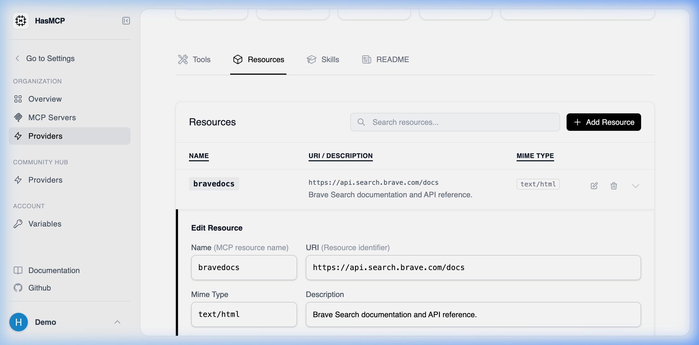

# Updating a Provider Resource

## Using HasMCP UI



Updating a resource visually is completed within the details view:
1. Locate the assigned metadata blob in the **Resources** tab of your Provider.
2. Click the localized **Edit** button.
3. The Edit Resource modal appears; adjust the `mimeType`, name, or modify the target `uri`.
4. Hit **Save** to distribute the changes down to any attached MCP servers automatically.

## Using REST API

Should an underlying static API path shift, or if you need to alter the URI format the LLMs utilize to call the file context natively, you patch the resource definition.

### The API Endpoint

**`PATCH /providers/{providerId}/resources/{id}`**

### Constructing the Update Payload

Send a JSON structure formatted against the `UpdateProviderResourceRequest` schema. Like other patch mechanisms in HasMCP, you only need to supply the specific key-value pairs inside the `resource` object you wish to mutate.

#### Example Request Structure

```bash
curl -X PATCH https://app.hasmcp.com/api/v1/providers/kSuB9Gf6aD4/resources/rA9BdO1kZ5T \
  -H "Authorization: Bearer YOUR_TOKEN" \
  -H "Content-Type: application/json" \
  -d '{
    "resource": {
      "description": "An updated context describing the log file mapping more coherently.",
      "uri": "https://api.example.com/v2/system/logs/error-new"
    }
  }'
```

An immediate `200 OK` confirms that any MCP server actively attached to this provider resource will instantly adapt to proxied data through the updated routes.
