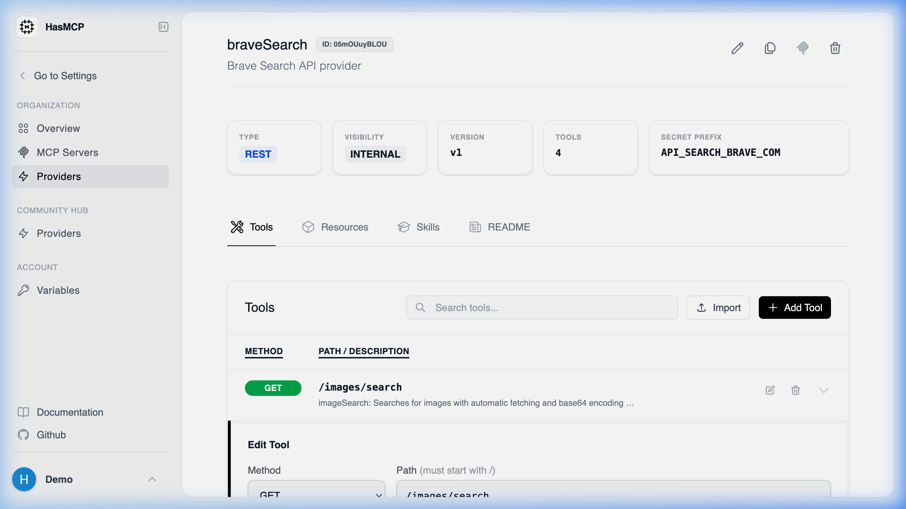

# Modifying a Provider Tool

## Using HasMCP UI



Updating a specific tool visually:
1. From the Provider Details page, locate your target tool in the tool list.
2. Click the **Edit** button contextually aligned with it.
3. A modal will appear allowing you to alter the tool's `description`, `inputSchema`, or `execution` path.
4. Click **Save** to apply the configuration patch.

## Using REST API

APIs evolve. If an endpoint changes its expected path parameters or if you wish to refine a tool description to get better LLM adherence, you can iteratively update a specific tool.

### The API Endpoint

**`PATCH /providers/{providerId}/tools/{id}`**

### Making the Patch Request

Send a request embedding the `UpdateProviderToolRequest` data payload. Only include the fields inside the `tool` object that you explicitly wish to modify—omitted fields will retain their existing configurations.

#### Example Update Request

```bash
curl -X PATCH https://app.hasmcp.com/api/v1/providers/kSuB9Gf6aD4/tools/tOlM8Hr2zP1 \
  -H "Authorization: Bearer YOUR_TOKEN" \
  -H "Content-Type: application/json" \
  -d '{
    "tool": {
      "description": "An UPDATED prompt for the LLM. Describe the query accurately.",
      "execution": {
        "method": "POST",
        "path": "/api/v3/customers/query"
      }
    }
  }'
```

If the syntax and schemas are valid, HasMCP responds with `200 OK` signaling that all connected servers mapped to this tool will now utilize the updated configuration in real-time.
