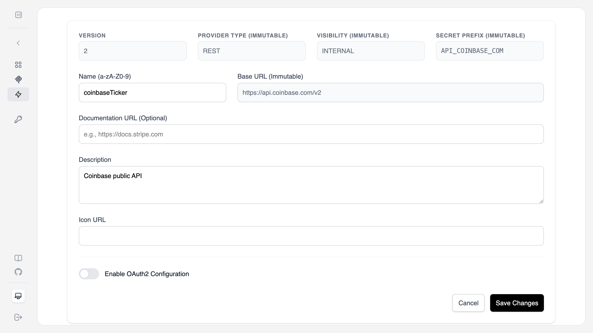
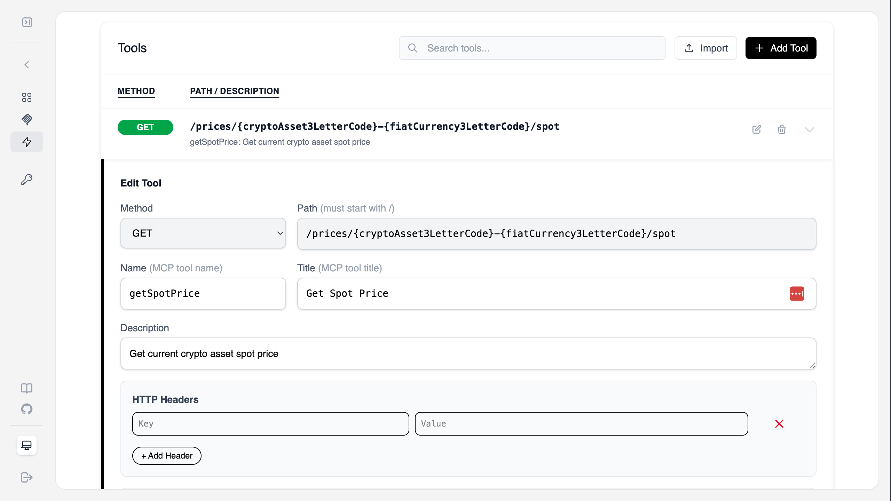
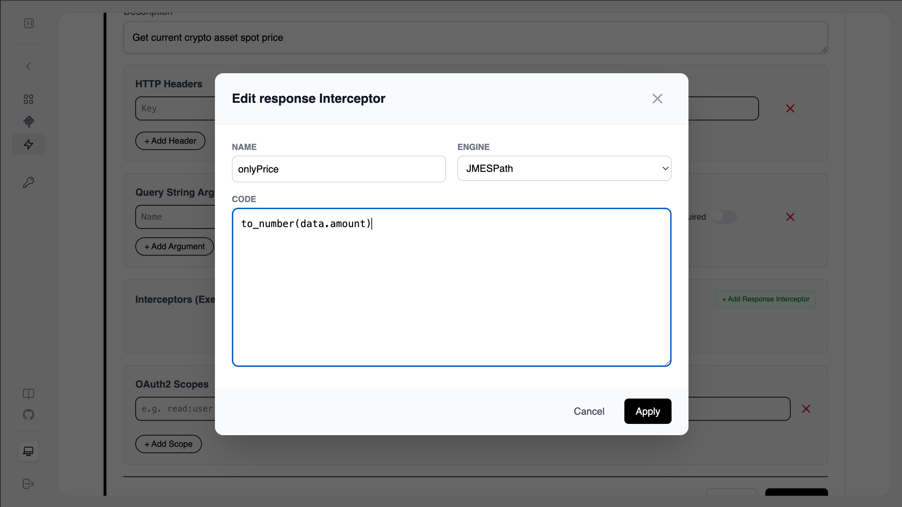
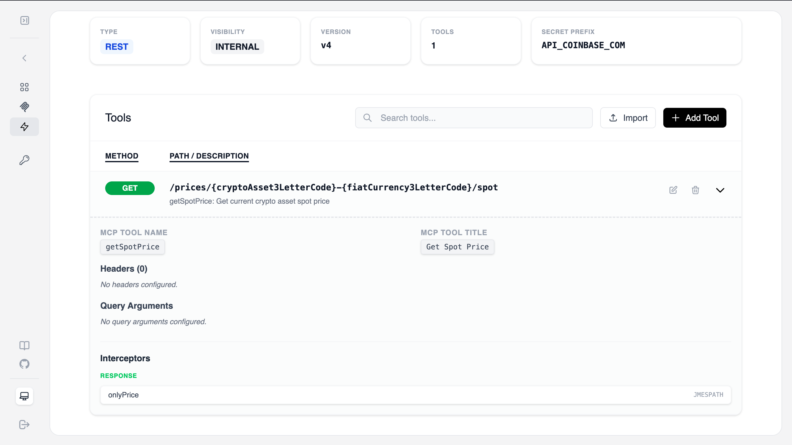
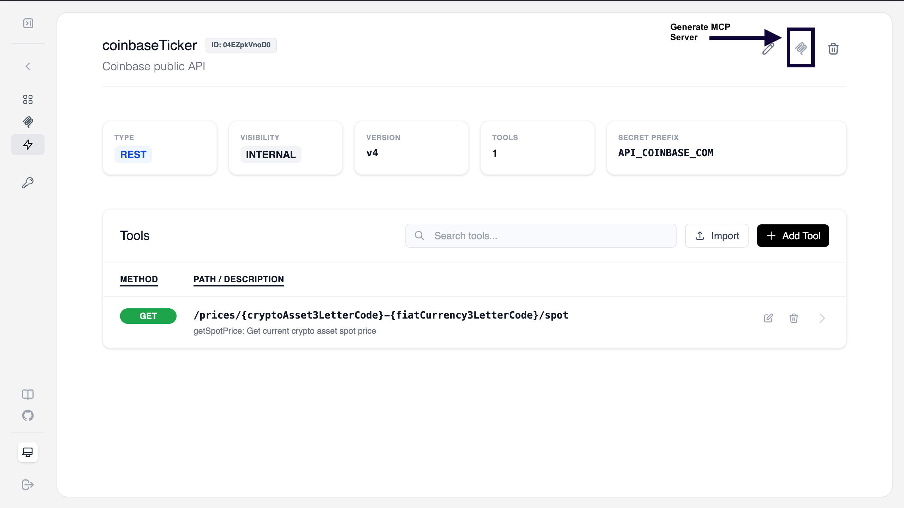
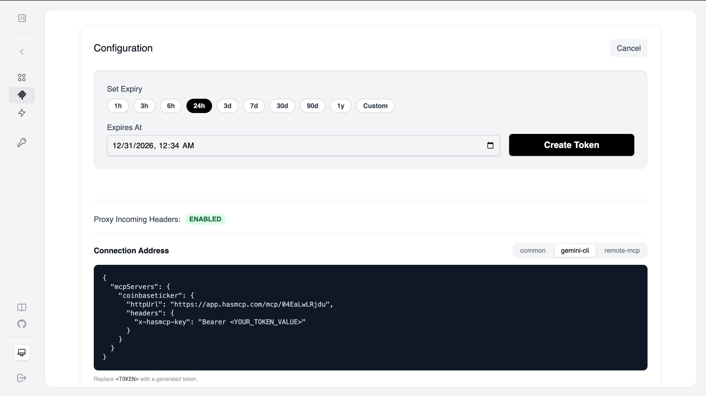
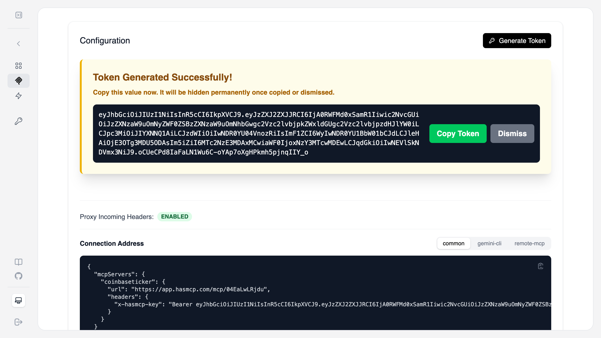
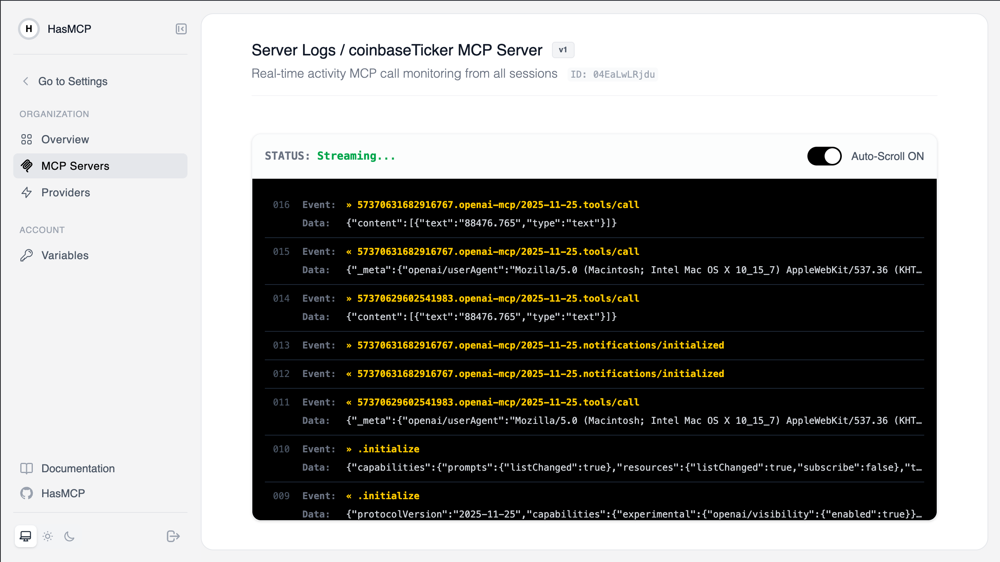

In this tutorial, you will learn how to use **HasMCP** to transform a public REST API into a fully functional Model Context Protocol (MCP) Server. We will build a tool that fetches real-time cryptocurrency spot prices from Coinbase, optimizes the response using JMESPath, and monitors the traffic in real-time.

## Prerequisites

- A HasMCP account.
- High level understanding of REST APIs.

---

## Plan

Preparation → API definition (API Provider) → MCP tool (API endpoint) → Optimize for token usage (optional) → Convert it to MCP Server → Trace real-time activity

## Get familiar with the endpoint details

In this example, Coinbase public API will be converted into MCP Server. Before moving forward let’s check the API link and its response:

**API endpoint:** https://api.coinbase.com/v2/prices/BTC-USD/spot

**Dynamic path params:** Coinbase API allows setting pairs of crypto assets to fiat currency like BTC to USD becomes BTC-USD. So when we need to get current ETH price we will need to replace BTC string with ETH like: https://api.coinbase.com/v2/prices/ETH-USD/spot

**API response (sample response):**

```
{"data":{"amount":"90521.995","base":"BTC","currency":"USD"}}
```

## Step 1: Create an MCP Provider

First, we need to define where the data is coming from. In HasMCP, a **Provider** represents the base API service.

1.  Navigate to the **Providers** section and click **Add Provider**.
2.  Fill in the configuration:
    - **Name**: `coinbaseTicker`
    - **Provider Type**: `REST`
    - **Visibility**: `INTERNAL`
    - **Base URL**: `https://api.coinbase.com/v2`
    - **Secret Prefix**: `API_COINBASE_COM` (This helps manage environment variables if needed later).
3.  Click **Save Changes**.



---

## Step 2: Define the MCP Tool

Now, let's add a specific tool to our provider that fetches the spot price.

1.  Inside your new `coinbaseTicker` provider, click **Add Tool**.
2.  Set the following details:
    - **Method**: `GET`
    - **Path**: `/prices/{cryptoAsset3LetterCode}-{fiatCurrency3LetterCode}/spot`
    - **Name**: `getSpotPrice`
    - **Title**: `Get Spot Price`
    - **Description**: `Get crypto asset current spot price`
3.  Click **Save**.



---

## Step 3: Optimize the Response with JMESPath (optional step)

By default, APIs often return more data than an LLM needs. We can use an **Interceptor** to prune the response, saving tokens and improving accuracy.
This operation can reduce LLM token usage up to 95%.
In this example, the only part needed by LLM to see the price of crypto asset. As you see from the actual API response the rest of the data is redundant to LLM and might be confusing for it. So, this example uses Jmespath to filter it down for what is needed only. Feel free to skip this step now. It is not a mandatory step. Using Jmespath or JS interceptor engines are advanced concept, it should be used very carefully after testing with real data.

1.  Scroll down to the **Interceptors** section of your tool.
2.  Click **Add Response Interceptor**.
3.  Configure the interceptor:
    - **Name**: `onlyPrice`
    - **Engine**: `JMESPath`
    - **Code**: `to_number(data.amount)`
4.  Click **Apply**. This transformation ensures the MCP server only returns the numerical price value.

Actual API Response:

```
{"data":{"amount":"90521.995","base":"BTC","currency":"USD"}}
```

Jmespath interceptor:

```
to_number(data.amount)
```

Tool response:

```
"90521.995"
```



Review your tool overview to ensure the interceptor is active.



---

## Step 4: Generate the MCP Server

With the provider and tool defined, it's time to deploy the actual MCP Server.

1.  Go back to the Provider overview page.
2.  Click the **Generate MCP Server** icon (the wellknown MCP icon) in the top right corner.



---

## Step 5: Secure and Connect

Your server is now live. You need to generate an authentication token to connect your local MCP client (like Claude Desktop or Gemini).

1.  On the Server overview page, click **Generate Token**.
2.  Select an expiry (e.g., `24h`) and click **Create Token**.
3.  **Copy the Token**: This is a one-time secret. Copy it immediately.
4.  Copy the **Connection Address** (JSON configuration) provided in the UI and paste it into your MCP client configuration file.




---

## BONUS: Let’s trace the real-time request response interaction logs to your MCP servers

Since you are a builder, you deserve to see what is going on behind the scene. MCP is a protocol build on top of the JSONRPC 2.0. It is making POST request to a MCP Server for each request and at the return it accepts either JSONRPC 2.0 response or text/event-steam with Streamable HTTP protocol. When it starts the session it also makes a single GET requests that listens the changes from the MCP Server. The first stream message sent by server is notifications/nitialized .

1. MCP Client sends initialize request to the MCP endpoint with JSONRPC 2.0

2. MCP Server responds with MCPSessionId header and all subsequent requests coming from MCP Client sends it to the server

3. MCP Client opens Streaming connection using the same endpoint but this time with GET request.

4. MCP Client send notifications/initialized no response event.

5. MCP Server send notifications/initialized using the event stream.

6. MCP Client sends request to MCP Server for tools/list , prompts/list and resources/list

7. MCP Client sends request to call tools using tools/call

8. MCP Server uses the endpoint defined as tool to make request and then uses interceptors to modify the payload if defined. NOTE: This step varies between MCP Servers, this is how HasMCP works.

9. MCP Server returns tool execution results.

See the trace logs the between agents, LLMs, your endpoint and your MCP Server using HasMCP real-time activity monitor:

One of the most powerful features of HasMCP is real-time monitoring. You can watch the raw communication between your LLM client and the Coinbase API.

1.  Navigate to the **MCP Servers** tab.
2.  Select your server and view the **Server Logs**.
3.  As you ask your LLM for crypto prices, you will see `tools/call` events streaming in real-time, showing the request parameters and the filtered JMESPath response.



## Conclusion

You've successfully built a crypto price checker MCP server! You can now expand this by adding more tools from the Coinbase API or adding JavaScript interceptors for even more complex logic.
